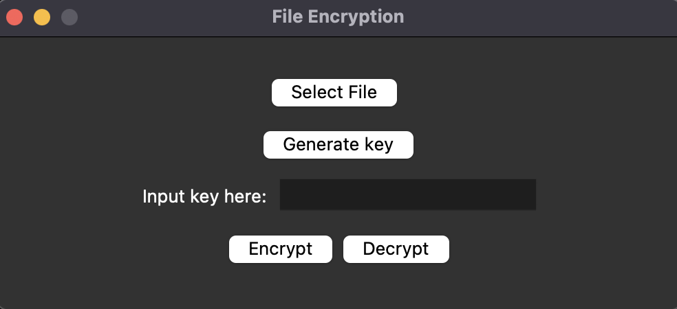
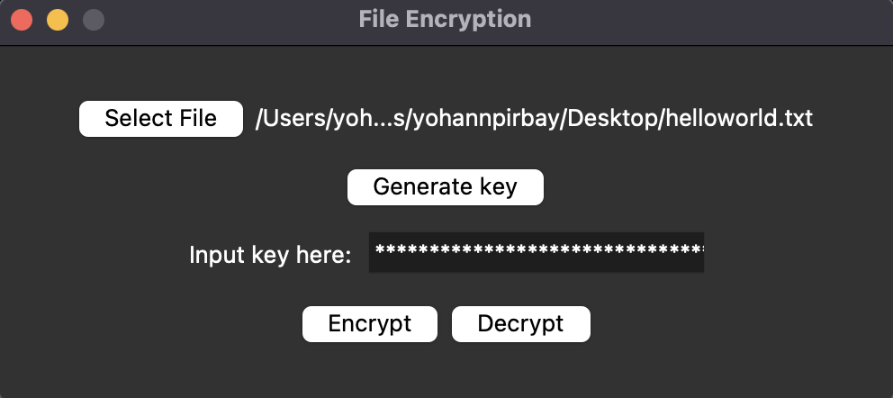
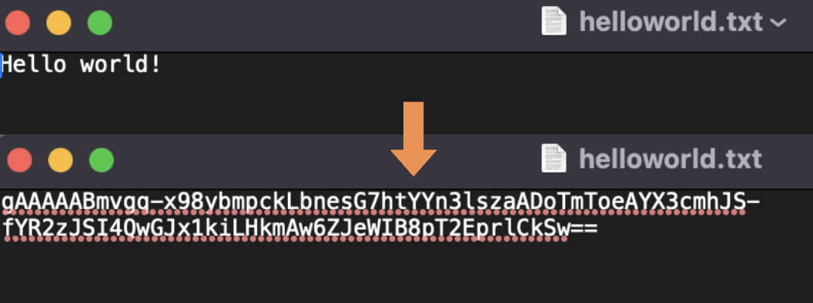

# File Encryption and Decryption

This is a simple file encryption and decryption application developed in Python using the `cryptography` library for cryptographic operations and `Tkinter` for the GUI. The application allows users to securely encrypt and decrypt text files.

The application uses Fernet encryption which employs AES (Advanced Encryption Standard) for encryption and HMAC (Hash-based Message Authentification Code) for authentication, ensuring both data confidentiality and integrity. Fernet is widely regarded as secure and follows industry standards for cryptographic practices.

NB: Only .txt files are supported for encryption/decryption and the app is only working on mac for now.

## Features
- Key Generation: Generate a new encryption key and copies it to the clipboard.
- File Encryption: Encrypt a selected text file using the provided key.
- File Decryption: Decrypt a previously encrypted text file using the provided key.
- User-Friendly and secure GUI: Simple interface for file selection and key input, key is hidden by `*` symbols so no one can see them

## Screenshots

*Main screen of the app*


*File ready for encryption*


*Before and after encryption*

## Installation
- Prerequisites: Ensure you have Python installed on your system, along with the 'tkinter' library, which is necessary for the GUI to function. `Tkinter` typically comes pre-installed with Python, but if it's missing, you may need to install it separately.

Clone the repository: 
 ```
$ git clone https://github.com/yohannpirbay/File-Encryption-Decryption.git
```
Navigate to the correct file: 
```
cd File-Encryption-Decryption
```

Create a virtual environment: 
```
python3 -m venv venv
```

Activate the virtual environment: 
```
source venv/bin/activate
```

Install all required packages: 
```
pip3 install -r requirements.txt
```

Start the application: 
```
python3 main.py 
```

## Author
Yohann Pirbay

## License
This project is licensed under the MIT License. See the [LICENSE](LICENSE) file for details.
